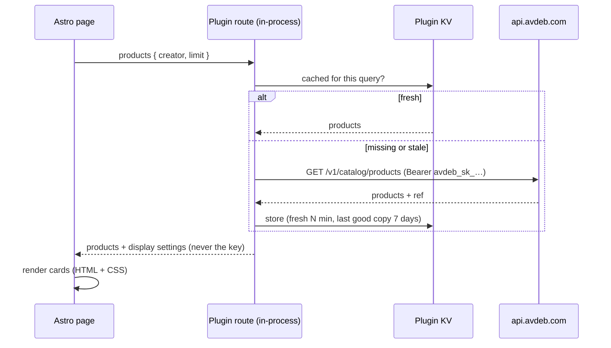

# AVDEB Products for EmDash

Embed [AVDEB](https://avdeb.com/developers/#emdash) products in an [EmDash](https://github.com/emdash-cms/emdash) site — a creator's shop, a category, a search or a single product — with **your referral code on every link**.

- **Three editor blocks** — type `/` in any rich-text field: **AVDEB Products**, **AVDEB Product**, **AVDEB Button**. Paste a creator, category or product link and the source is detected automatically.
- **Four layouts** — grid, carousel (scroll-snap, keyboard + arrow buttons), list ("shop the post") and spotlight (first product featured). Single products as compact card, horizontal card or hero, with your own badge and note.
- **Looks native on any theme** — container queries (embeds adapt to the column they sit in, not the viewport), inherit / light / dark / system themes, three card styles, accent colour, corner radius, image shape. Every selector is `:where()`-wrapped, so your CSS always wins.
- **Fast and resilient** — products are fetched server-side, cached in plugin KV per query, and the last good copy is served for a week if AVDEB is unreachable. Identical embeds on one page share a single lookup.
- **Honest links** — referral links get `rel="sponsored"`; an optional disclosure line appears under embeds that carry a code.
- **Private by default** — no third-party scripts, no cookies, no iframes, no tracking. The only client JS is ~40 lines for carousel arrows.
- **Admin overview** — connection status ("Connected as …"), cache stats, a live product preview, "Refresh products now", plus a dashboard widget.
- **Agent-ready** — an MCP tool (`search_avdeb_products`) returns products with ready-to-insert block data.

## Install

```sh
npm install emdash-plugin-avdeb
```

```js
// astro.config.mjs
import { defineConfig } from "astro/config";
import emdash from "emdash/astro";
import { avdebProducts } from "emdash-plugin-avdeb";

export default defineConfig({
	integrations: [
		emdash({
			// …database, storage…
			plugins: [avdebProducts()],
		}),
	],
});
```

Requires EmDash ≥ 1.1 and Astro ≥ 6. This is a **trusted (native) plugin**: it adds Portable Text block types and Astro render components, which the sandboxed registry format can't. It requests one capability, `network:request`, limited to `api.avdeb.com`.

## Configure

Open **Plugins → AVDEB Products → Settings** in the EmDash admin.

| Setting | |
|---|---|
| **Secret key** | Optional, recommended. `avdeb_sk_…` from the partner dashboard → *Embeds & API*. Your referral code is added automatically and embeds can show up to 48 products. Stored encrypted — the site needs `EMDASH_ENCRYPTION_KEY`. |
| **Referral code** | Used only without a key: added as `?ref=` to every AVDEB link (max 12 products per embed). |
| Layout, columns, card style, theme, accent colour, radius, image shape, button text | Site-wide defaults; every block can override them. |
| Prices / designer names / Sale & New badges / new tab | Toggles. |
| Disclosure | Shown under embeds whose links carry a referral code (e.g. US FTC rules). |
| Refresh every | Cache lifetime in minutes (default 360). |

Without a key or code the plugin still works and shows plain AVDEB links.

## Become an AVDEB affiliate (or creator)

You only need an account to earn commission. Program details:
[avdeb.com/affiliate](https://avdeb.com/affiliate/) — 5% commission, 30-day cookie, monthly PayPal payouts in USD
($50 minimum), open worldwide, approval usually within 24 hours.

1. Open [avdeb.com/affiliate/apply](https://avdeb.com/affiliate/apply/).
2. **Account** — email + password (or *Sign in* if you already have an AVDEB account).
3. **Program** — *Affiliate* (share products, earn commission), *Creator* (submit sticker / 3D designs that
   AVDEB prints and ships; you earn on every sale), or both.
4. **Personal information & details** — first/last name, country, tax residency, legal name (business name optional).
5. **Address** — street, city, state/province, postal code.
6. **Payout & promotion** — PayPal email for commissions; optionally your website and social links.
7. Accept the Terms & Conditions and Privacy Policy → **Create Account & Apply**.
8. After approval you get your referral link by email and in the dashboard.
9. Partner dashboard → **Embeds & API** ([direct link](https://avdeb.com/affiliate/dashboard/developers/)) →
   create a **secret key** (`avdeb_sk_…`), or copy your referral code from **Links**.
10. EmDash admin → **Plugins → AVDEB Products → Settings** → paste the key (or code) → **Save**. The overview
    shows "Connected as …" and every embed now carries your code. (A key needs `EMDASH_ENCRYPTION_KEY` set on the site.)

Creators: once your designs are listed, show them with `<AvdebProducts creator="your-slug" />` or an
**AVDEB Products** block pointed at `https://avdeb.com/creators/your-slug/`.

Please disclose affiliate links to your readers — turn on the **Disclosure** setting and it's added for you.

## In content

| Block | Fields |
|---|---|
| **AVDEB Products** | Link or search (`https://avdeb.com/creators/you/`, `/category/stickers/`, `cat stickers`), source (auto, creator, category, product type, search, newest), layout, number, columns, heading, intro, "View all" link, card style, theme, button text, hide prices / designers |
| **AVDEB Product** | Product link or handle — or pick one of your recent products — style (horizontal, hero, compact), badge ("Editor's pick"), your note, button text |
| **AVDEB Button** | Any AVDEB link, text, style (solid, outline, text link), alignment |

Renderers are wired into `<PortableText>` automatically. Override one with your own component via `components.types["avdeb-products"]`.

## In templates

```astro
---
import { AvdebProducts, AvdebProduct, AvdebButton } from "emdash-plugin-avdeb/ui";
---

<AvdebProducts creator="your-slug" layout="carousel" limit={8} heading="From my shop" />
<AvdebProducts url="https://avdeb.com/category/stickers/" columns={4} cardStyle="outline" />
<AvdebProducts q="cat stickers" layout="list" limit={3} headingLevel={3} heading="In this post" />
<AvdebProduct handle="cat-sticker" variant="hero" badge="Editor's pick" note="I use it every day." />
<AvdebButton href="/creators/your-slug/" label="Visit my shop" variant="outline" align="center" />
```

`AvdebProducts` accepts `url | creator | tag | type | q`, `limit`, `layout`, `columns`, `cardStyle`, `theme`, `heading`, `intro`, `headingLevel`, `viewAll`, `ctaLabel`, `hidePrice`, `hideCreator`, `class`.

## Theming

Everything is a CSS custom property on `.avdeb` (embeds) or `.avdeb-cta` (buttons):

```css
.avdeb {
	--avdeb-accent: #4d7f5a;          /* prices, sale badge, CTAs, focus ring */
	--avdeb-accent-contrast: #fff;    /* text on accent */
	--avdeb-radius: 20px;
	--avdeb-gap: 1.25rem;
	--avdeb-card-bg: #fff;
	--avdeb-border: #e5e7eb;
	--avdeb-shadow: 0 12px 32px -16px rgb(0 0 0 / 0.3);
	--avdeb-font-title: "Fraunces", serif;
}
.avdeb[data-theme="dark"] { --avdeb-card-bg: #111; }
```

Also available: `--avdeb-surface`, `--avdeb-border-soft`, `--avdeb-media-bg`, `--avdeb-muted`, `--avdeb-badge-bg`, `--avdeb-badge-text`, `--avdeb-shadow-hover`, `--avdeb-pad`, `--avdeb-ratio`. BEM classes (`.avdeb-card__title`, `.avdeb-badge--sale`, …) are stable.

## How it works



The render route is public (EmDash's SSR dispatcher only calls public routes), so it returns only public catalog data, re-validates every input, caps AVDEB requests at 30 per minute and a daily cron removes expired cache entries. The secret key never leaves the server.

## Development

```sh
npm install
npm test            # node --test (Node ≥ 22.18, TypeScript type-stripping, no build step)
npm run typecheck
```

```
src/index.ts        descriptor (astro.config) + createPlugin(): capabilities, routes, cron, MCP, admin
src/catalog.ts      catalog API contract: query sanitising, response validation, links
src/client.ts       KV cache: fresh / stale / back-off, request budget, key check, cleanup
src/settings.ts     settings schema + validation
src/blocks.ts       Portable Text block definitions, block node → request
src/view.ts         card view models, prices, badges, "View all", inline style
src/routes.ts       route handlers          src/admin.ts   Block Kit overview + widget
src/payload.ts      re-validation on the rendering side
src/astro/          Embed.astro (all layouts + styles), Button.astro, block renderers, loader
src/ui.ts           template components
```

## License

MIT
